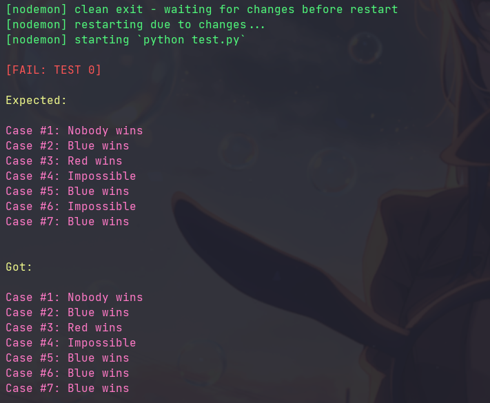

# Google Kick Start

> "Kick Start is a global online coding competition, consisting of three-hour
> rounds of a variety of algorithmic challenges designed by Google engineers"

## Tests

Some exercises have tests, if changing something is recommended use something
like [Nodemon](https://github.com/remy/nodemon/) to get feedback at every file
save.

Example

```
nodemon 2022/hex/test.py
```

Will give an output similar to this at any change in the file 👇


